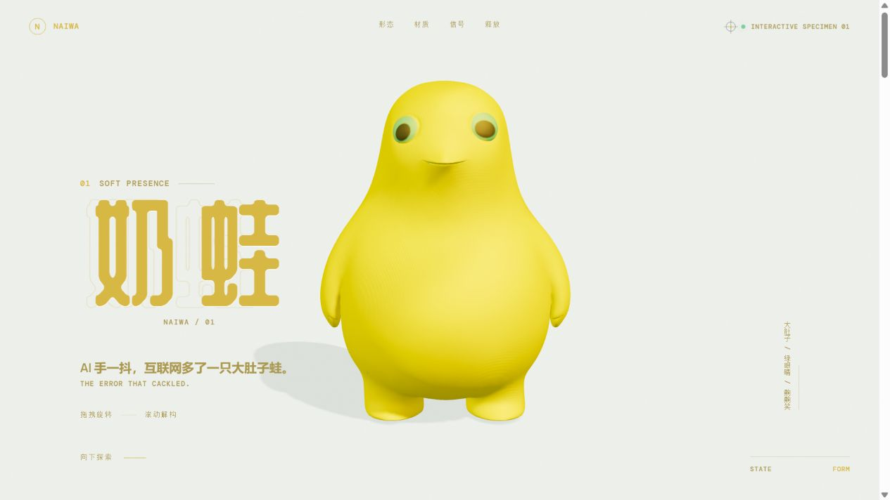
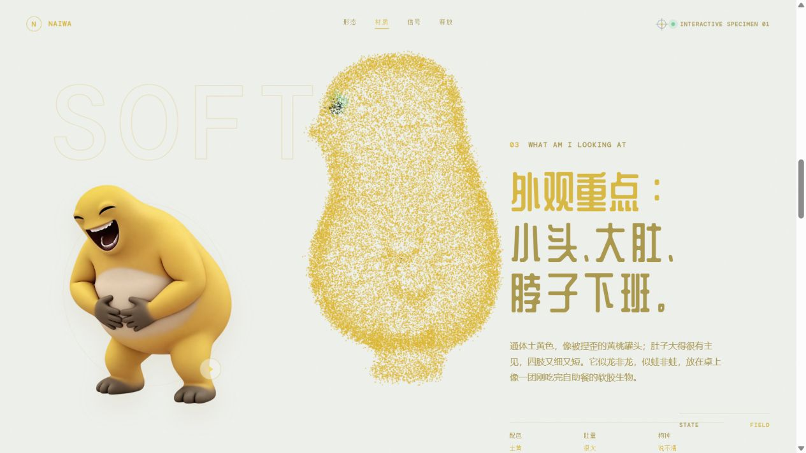
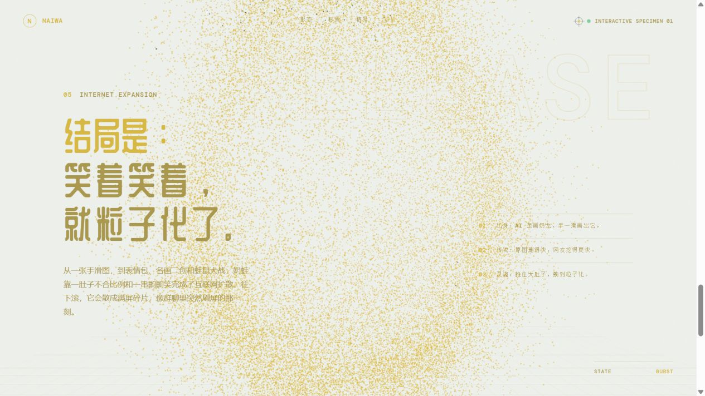

# 奶蛙 / NAIWA

一份围绕奶蛙形象制作的交互式三维角色档案。

页面从完整形体开始：淡黄软壳、巨大的浅绿眼圈和沉默的横线嘴巴共同构成奶蛙。随着滚动，形体逐步解构为保留原始色彩与轮廓的三维粒子场，最终散入整个画面。

拖拽模型可以观察形体，滚动则推进从实体、粒子到释放的完整叙事；材质、粒子响应与笑声互动均可在页面中实时体验。

## 页面预览

| 初始形态 | 材质与粒子过渡 |
| --- | --- |
|  |  |

| 最终释放 |
| --- |
|  |

## 本地运行

```bash
npm install
npm run dev
```

## 技术栈

- Vite
- Three.js / OGL
- GSAP
